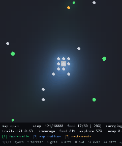

# Ant-Colony-MARL 🐜

A biologically inspired **multi-agent** environment where ant-like agents forage
cooperatively using only *local* perception and a *shared, decaying pheromone
field* — exactly the way real ants coordinate. Pheromone is secreted
**automatically** (chemically), the field **evaporates and diffuses**, and you
can **see it all** as a live, toggleable heatmap.

> **The central question:** does **stigmergy** — coordination through a shared
> environment that agents modify and sense — let the colony forage better, and
> can a learning policy exploit it? No agent ever talks to another; the only
> channel between them is the pheromone they leave behind.



*Green = food/recruitment trail · Blue = exploration scent · Amber = nest scent.
Where layers overlap they blend (green+blue → cyan), so heavily-used routes glow.*

## Demo

**Real-time interactive viewer** (no training required — driven by a scripted forager):

```bash
pip install -r requirements.txt
python -m antworld.viewer                       # open arena, 40 ants
python -m antworld.viewer --map t_shape --agents 60 --evaporation 0.02
```

Controls (also shown in the on-screen HUD):

| key | action | key | action |
|----|----|----|----|
| `1` `2` `3` | toggle food-trail / exploration / nest-scent layers | `Space` | pause / resume |
| `T` `G` `A` `H` | toggle terrain / grid / ants / HUD | `S` `.` | single step (paused) |
| `↑` `↓` | raise / lower **evaporation** live | `R` | reset (new layout) |
| `←` `→` | lower / raise **diffusion** live | `+` `-` | sim speed | 
| | | `Esc` `Q` | quit |

**In-browser version** (shareable, scrub through frames, ablation toggle):

```bash
streamlit run demo/app.py
```

## Features

- **PettingZoo `ParallelEnv`** — all ants act simultaneously, not in turns.
- **Automatic pheromone secretion** — like real ants, deposition is *not* a
  decision: a carrying ant lays a food/recruitment trail every step; a searching
  ant leaves a faint exploration scent. The policy only chooses **where to move**.
- **Shared, decaying field** — 3 channels (food trail, exploration, nest scent),
  fixed update order **deposit → clip → evaporate → diffuse (Gaussian) → clip**.
- **Live heatmap rendering** — additively-blended pheromone layers over a dark
  arena; toggle layers and tweak evaporation/diffusion and watch trails respond.
- **Purely local perception** — each ant sees a 5×5 egocentric window
  (179-dim observation); never global state. RL-ready.
- **Stigmergy diagnostic** built into the env — the *trail-utilization rate*
  (fraction of searching moves that climb an existing food trail).
- **Curriculum maps** — `open → obstacles → t_shape → multi_food`.
- **Reproducible** — every run is seeded; no un-seeded randomness in the env.

## Motivation

Real ant colonies coordinate impressive collective behaviour with no central
controller and almost no individual intelligence. A foraging ant secretes a
pheromone trail on its way back from food; nestmates that encounter the trail
tend to follow it, reinforcing it while it still leads to food and letting it
evaporate when it doesn't. This indirect, environment-mediated coordination is
**stigmergy**.

AntWorld lets you *watch* that process emerge from simple local rules — and is
built so a learning policy can be dropped in to ask whether agents **exploit**
the field, and whether coordinating through it makes the colony forage better
(flip `trail_enabled` off for a matched control).

## How it works

### Environment — `antworld/env.py`

A 2D top-down grid; cells are floor, wall, or nest, with food at a few source
cells some distance from the nest. Ants spawn at the nest, search, pick food up,
carry it home, and deliver it. Pickup, secretion, and delivery are **automatic on
contact** — an ant only steers.

- **Observation** (179-dim, normalized, local): `5×5×4` terrain (floor, wall,
  food, nest) + `5×5×3` pheromone (food trail, exploration, nest scent) + 4 self
  features (carrying, hunger, own row, own col — proprioceptive *path
  integration*, à la *Camponotus*).
- **Actions** (8, discrete): 8-connected movement only — `N, NE, E, SE, S, SW, W, NW`.
- **Rewards** (foraging only): food delivered **+1 (shared across the colony)**,
  pick-up +0.01, moving closer to the nest while carrying +0.01, per-step cost
  −0.001. Pheromone is never rewarded — coordination has to pay its way through
  better foraging.

### Pheromone system — `antworld/pheromone.py`

A multi-channel scalar field. Each step, in fixed order: deposits are applied
(carrying → food-trail, searching → exploration scent, nest → homing scent),
then **clip → evaporate (`field *= 1 − rate`) → diffuse (Gaussian) → clip**.
Evaporation makes trails *transient*: a route persists only while ants keep
reinforcing it. The food-trail and exploration channels are the stigmergic ones
(laid by peers); the nest scent is a homing aid emitted by the nest and gated
separately, so the stigmergy ablation changes exactly one variable.

### Agents — `antworld/scripted.py`

For now a hand-coded **`ScriptedForager`** drives the colony so the world does
something interesting immediately: carrying ants home in on the nest scent;
searching ants follow nearby food trails up-gradient (recruitment) and otherwise
fan out toward unexplored ground. It reads env state directly (it is a
diagnostic, not the learned policy).

### Learning algorithm — *next milestone*

The env is a proper `ParallelEnv` with a normalized local observation, a discrete
action space, and a shaped cooperative reward — i.e. ready for RL. The planned
trainer is **Independent PPO (IPPO)** with a single shared-parameter actor-critic
(homogeneous colony; any role specialization must *emerge*). See the roadmap.

## Architecture

```
Ant-Colony-MARL/
├── antworld/
│   ├── env.py          # AntWorldEnv — PettingZoo ParallelEnv (the contract)
│   ├── pheromone.py    # PheromoneField — deposit/clip/evaporate/diffuse
│   ├── ant.py          # per-agent state (position, carrying, hunger)
│   ├── maps.py         # curriculum maps (open/obstacles/t_shape/multi_food)
│   ├── scripted.py     # ScriptedForager — non-learning policy for the viewer
│   ├── renderer.py     # Pygame heatmap rendering (read-only)
│   ├── viewer.py       # interactive real-time app (python -m antworld.viewer)
│   └── config.py       # EnvConfig + OBS_VERSION (env-contract version)
├── demo/app.py         # Streamlit in-browser viewer
├── tests/              # pytest: pheromone math / mechanics / determinism / diagnostic
├── docs/               # design notes + demo.gif
└── requirements.txt
```

**Separation of concerns is load-bearing:** `env.py` knows nothing about
rendering or any learning algorithm; the renderer reads state and never mutates
it; importing `antworld` never imports pygame (it's pulled in lazily).

## How to run

```bash
git clone https://github.com/JacobL04/Ant-Colony-MARL.git
cd Ant-Colony-MARL
pip install -r requirements.txt        # numpy, scipy, pettingzoo, gymnasium, pygame, ...

python -m antworld.viewer              # interactive viewer (the main demo)
streamlit run demo/app.py              # in-browser viewer
pytest -q                              # env / pheromone / determinism tests
```

> The viewer and tests need only the lightweight stack (numpy/scipy/pettingzoo/
> gymnasium/pygame). `torch` is listed for the upcoming RL phase.

### Configuration

The whole world is one `EnvConfig` dataclass (`antworld/config.py`) — grid size,
colony size, the pheromone dynamics (`evaporation_rate`, `diffusion_sigma`,
`food_trail_deposit`, `explore_deposit`, `nest_emission`, `pheromone_max`), the
ablation switches (`trail_enabled`, `nest_scent_enabled`), rewards, and food
layout. The viewer exposes the common knobs as CLI flags and live keys.

## Emergent behaviours to watch for

- **Trail formation & following** — `trail_utilization` rising above ~0 means
  searching ants are climbing food-trail gradients laid by others.
- **Recruitment cascades** — once one ant finds food and trails home, others
  lock onto the trail and a bright highway forms (visible in the heatmap).
- **Evaporation tuning** — too slow and stale trails mislead; too fast and trails
  vanish before they recruit. Drag the `↑`/`↓` keys and watch.

## Roadmap

- [ ] **IPPO trainer** (`train.py`) — shared-parameter actor-critic over the N
  synchronized ants; primary metric = food delivered per episode.
- [ ] **Eval + video** (`eval.py`) — load a checkpoint, render, record an mp4.
- [ ] **Experiment suite** (`experiments/*.yaml`) — stigmergy ablation
  (trails on vs off), evaporation sweep, curriculum transfer, colony size, roles.
- [ ] **Explicit-communication baseline** — a message channel to compare against
  pure stigmergy.
- [ ] **Other insect dynamics** — additional colonies, aphids, predators
  (deliberately deferred to avoid scope creep).

## References / inspiration

- Stigmergy & ant trail foraging (Deneubourg, Goss, et al.).
- Reference species: *Camponotus* (carpenter ant) — path integration & trail recruitment.
- PettingZoo `ParallelEnv`; PPO / IPPO for multi-agent RL.

## Tech stack

Python · NumPy / SciPy · PettingZoo · Gymnasium · Pygame · Streamlit · (PyTorch, for the RL phase)
